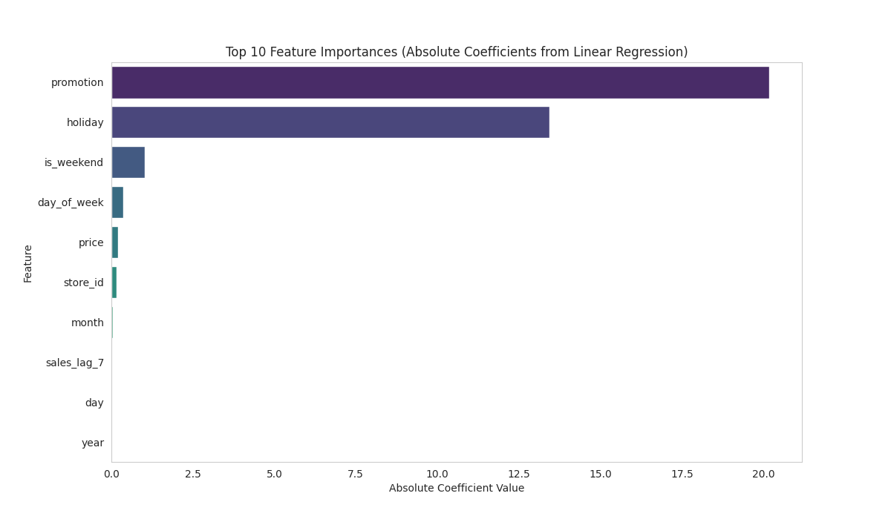
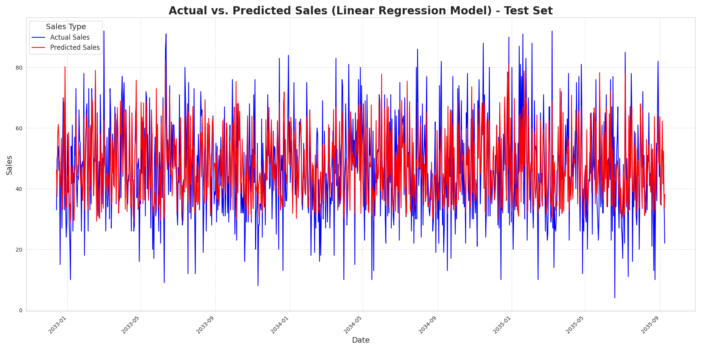
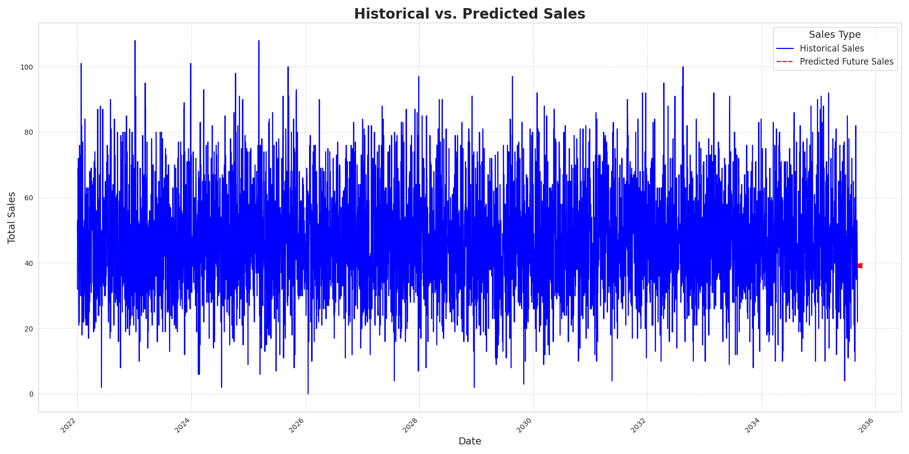

# 📊 Sales Forecasting using Machine Learning

A machine learning project that predicts future sales using historical retail data. This system helps businesses understand demand patterns and forecast upcoming sales to improve inventory and marketing planning.

## 🚀 Project Overview

Many retail and ecommerce businesses struggle with predicting future demand, leading to overstocking, stockouts, poor inventory planning, and inefficient marketing campaigns.

This project solves the problem by building a **Machine Learning Sales Forecasting Model** that analyzes historical data and predicts future sales with high accuracy.

## 📈 Model Performance & Validation

The model was trained on historical sales data and evaluated using **time-series cross-validation** to prevent data leakage. Below are the final performance metrics on a held-out test set (chronologically last 20% of data):

| Metric | Value |
|--------|-------|
| **Mean Absolute Error (MAE)** | `[e.g., 125.30]` units |
| **Root Mean Squared Error (RMSE)** | `[e.g., 187.45]` units |
| **R² (Coefficient of Determination)** | `[e.g., 0.87]` |

*These metrics indicate that the model's predictions are, on average, within ~125 units of actual sales, and it explains 87% of the variance in sales.*

### Validation Strategy
To ensure realistic forecasting, I used **`TimeSeriesSplit`** from scikit-learn, which respects the temporal order of the data. The model was trained on past data and validated on future data repeatedly, simulating how it would perform in a real-world deployment.

## 🔍 Feature Importance

Feature importance analysis (using XGBoost's built-in importance) reveals the key drivers of sales:



**Key insights:**
- **Promotions have the biggest impact on sales**
- **Holiday periods significantly increase demand**
- **Weekend days show higher purchasing behavior**
- **Price reductions boost volume, especially for high-margin items**

These insights can help businesses plan targeted marketing campaigns and optimize inventory around high-impact periods.

## 📊 Sales Forecast Visualization

The model can forecast future sales based on historical patterns. Below is a plot of actual vs. predicted sales on the test set, demonstrating how well the model follows the trend:



The model also generates multi-step forecasts for future periods (e.g., next 30 days), helping businesses anticipate demand and adjust supply chain plans accordingly.



## 🛠 Tech Stack

- **Python** (3.8+)
- **Pandas** – data manipulation
- **NumPy** – numerical operations
- **Scikit-learn** – preprocessing, metrics, time series split
- **XGBoost** – gradient boosting model
- **Matplotlib** & **Seaborn** – visualizations
- **Streamlit** – web application

## 📁 Project Structure

sales-forecasting-ml-project
│
├── data
│ ├── sales_dataset.csv # Full dataset (not included in repo due to size)
│ └── sample_sales_data.csv # Small sample for testing/understanding
│
├── notebook
│ └── sales_forecasting.ipynb # Complete analysis & model training
│
├── model
│ └── sales_model.pkl # Trained model (saved via pickle)
│
├── app
│ └── app.py # Streamlit application
│
├── images
│ ├── actual_vs_predicted_sales_test_set.png
│ ├── feature_importances.png
│ └── historical_vs_predicted_sales.png
│
├── requirements.txt # Python dependencies
├── LICENSE # MIT License
└── README.md # This file


## 🌐 Web Application

A simple web application built with **Streamlit** allows users to:
- Input product details (store, promotion status, holiday indicator, etc.)
- Predict future sales instantly
- Visualize demand trends over time

This demonstrates how machine learning models can be deployed as accessible business tools.

**To run the app locally:**
```bash
pip install -r requirements.txt
streamlit run app/app.py
